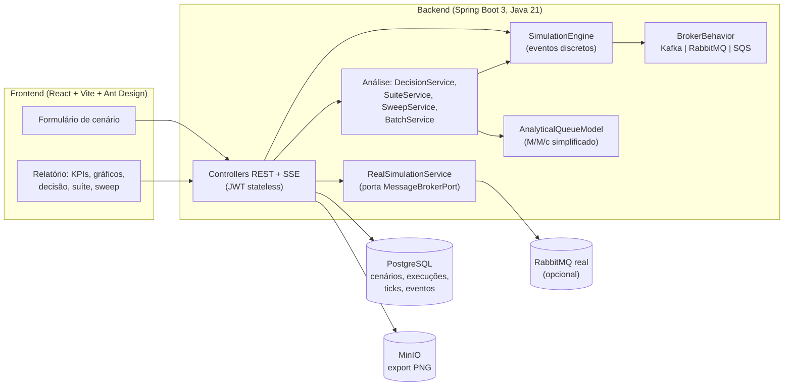

# Simulador de Mensageria

Simulador didático que coloca **Kafka**, **RabbitMQ** e **SQS/SNS** sob a mesma carga e mostra, com números que dizem quando não sabem, qual se comporta melhor e por quê. Você descreve um cenário (taxa, consumidores, tempo de processamento, falhas, retries, DLQ, burst...), roda a simulação (instantânea ou ao vivo) e recebe latências, backlog, retries, perda, custo, um score por broker e uma matriz *broker × cenário*.

O ponto do projeto não é prever produção. É mostrar como cada broker **falha** (descarta, bloqueia o produtor, esgota o in-flight, acumula backlog) e quanto do resultado é ruído de simulação.

> Construído sobre o template BIMD (`Main ReadMe.md`): Java 21 / Spring Boot 3 + PostgreSQL no backend, React + TypeScript + Vite + Ant Design no frontend, autenticação JWT stateless.

---

## Sumário

1. [Arquitetura](#arquitetura)
2. [Como o motor funciona](#como-o-motor-funciona)
3. [Como cada broker se comporta](#como-cada-broker-se-comporta)
4. [Camada de análise (resultados honestos)](#camada-de-análise-resultados-honestos)
5. [Rodando localmente](#rodando-localmente)
6. [Como usar](#como-usar)
7. [API](#api)
8. [Testes](#testes)
9. [Estrutura do repositório](#estrutura-do-repositório)
10. [Documentação de estudo](#documentação-de-estudo)
11. [Limitações conhecidas](#limitações-conhecidas)

---

## Arquitetura



**Duas fontes de números, de propósito.** O motor simula mensagem a mensagem; o modelo analítico é uma fórmula fechada. Elas ficam em código separado e o relatório mostra o erro entre as duas: se o modelo diverge da simulação além de um limiar, ele é marcado como *não confiável*.

### Backend (`backend/src/main/java/com/bimd/msgsim`)

| Pacote | Responsabilidade |
|---|---|
| `controller` | REST (`Auth`, `Profile`, `Scenario`, `Run`, `Broker`, `Storage`) e o stream SSE da execução ao vivo |
| `service/simulation` | Motor de eventos (`SimulationEngine`, `SimulationState`), `BrokerBehavior` por broker, execução instantânea e ao vivo, `BatchService` (N rodadas) |
| `service/report` | Modelo analítico, score, `DecisionService`, `SuiteService`, `SweepService`, narrativa e conclusão em texto |
| `service/real` | Execução real contra RabbitMQ (ports and adapters) |
| `service/scenario` | CRUD e validação por broker |
| `domain`, `repository` | Entidades JPA, DTOs, mappers (MapStruct), repositórios |
| `security` | Filtro JWT stateless |

Schema controlado por Flyway (`backend/src/main/resources/db/migration`), com `ddl-auto=validate`.

### Frontend (`frontend/src`)

| Pasta | Conteúdo |
|---|---|
| `pages/ScenariosPage` | Lista e formulário de cenário; campos do broker escolhido aparecem, os dos outros somem |
| `pages/ReportPage` | Relatório: KPIs, throughput, backlog, latência, utilização por consumidor, decisão, suíte, sweep, faixa de resultados |
| `pages/ComparePage` | Comparação lado a lado de dois cenários |
| `api/modules` | Cliente HTTP e tipos; estado só com hooks e Context (sem Redux) |

---

## Como o motor funciona

O motor é uma **simulação por eventos discretos**: uma fila de eventos futuros (min-heap) ordenada por instante; o relógio salta para o próximo evento em vez de avançar de 1 em 1 segundo.

- **Eventos:** chegada, conclusão de processamento, reaparecimento (retry com atraso, como o visibility timeout do SQS) e uma varredura por segundo (retenção, overflow, fechamento do tick).
- **Cada mensagem é rastreada.** As latências p50/p95/p99 são percentis medidos (espera + serviço + overhead do broker), não fórmulas.
- **Três streams de aleatoriedade** (chegadas Poisson, tempo de serviço, falhas), todos derivados de **uma seed**. Mudar a taxa de falha não altera as chegadas, e dois brokers rodando a mesma seed recebem exatamente as mesmas mensagens nos mesmos instantes. Reexecutar uma seed reproduz a execução.
- **Variação do serviço:** constante (melhor caso possível da teoria de filas), exponencial (padrão) ou cauda longa (5% das mensagens a 10× a média, mantendo a média).
- **Invariantes em toda simulação:** conservação (`produzidas = entregues + pendentes + descartadas + dlq`, falha ruidosa se não bater) e lei de Little (aviso se o erro passar de 2%, o que indicaria erro de contabilidade).
- **Calibração:** um teste compara a espera média simulada com a fórmula de Erlang-C (M/M/c) em 30/50/70/85% de ocupação, com tolerância de 5%.

Detalhes e trechos comentados em [`docs/02-simulation-engine.md`](docs/02-simulation-engine.md).

---

## Como cada broker se comporta

Tudo que é específico de broker vive atrás da interface `BrokerBehavior`, com quatro pontos de decisão. O resto do motor é genérico.

| | Aceita a mensagem? | Quantos consumidores processam | Retry | O que envelhece e some |
|---|---|---|---|---|
| **Kafka** | Sempre (append no log) | `min(consumidores, partições)` | Imediato (o offset não avança) | Os mais antigos, quando `fila × tamanho` passa da retenção (por tamanho ou tempo) |
| **RabbitMQ** | Acima do *high watermark* de memória **bloqueia o produtor**: o backlog estabiliza e nada é descartado | Todos, limitado pelo *prefetch* | Imediato (nack) | Nada por padrão; só o `max-length` (drop-head), se configurado |
| **SQS** | Sempre | Limitado pelo teto de mensagens *in-flight* (inclui as ocultas aguardando retry) | Só após o *visibility timeout* | Retenção de 4 dias |

Sob a mesma sobrecarga, o backlog do RabbitMQ estabiliza enquanto o do Kafka sobe até bater a retenção e passa a descartar.

**Parâmetros por broker no formulário** (padrões visíveis; deixe em branco para usar o padrão): Kafka: partições, retenção por tamanho (256 MB) e por tempo (168 h). RabbitMQ: high watermark (256 MB), prefetch (250), capacidade da fila (`max-length`). SQS: visibility timeout (30 s), in-flight máximo (120000).

> Retenção e high watermark valem 256 MB por padrão de propósito: com valores de produção (dias de log, GB de memória) uma simulação de 120 s nunca os atingiria.

**Tentativas e DLQ:** uma mensagem que falha é reenfileirada até `maxRetries` novas tentativas; ao esgotar vai para a DLQ, ou é descartada se a DLQ estiver desligada.

---

## Camada de análise (resultados honestos)

Nenhum número de rodada única é apresentado como resultado.

- **25 rodadas sempre** (decisão, suíte, sweep e faixa de resultados): mediana, p95 e pior caso. A **semente-mestre** fica visível e pode ser digitada para repetir exatamente as mesmas rodadas. O "Resultado instantâneo" é uma rodada única e vem rotulado assim.
- **Decisão (qual broker?):** pontua cada broker por estabilidade, latência p99, perda, custo e simplicidade operacional, com pesos ajustáveis, em rodadas *pareadas* (mesmas seeds para os três).
- **Empate por dispersão:** dois brokers empatam quando a diferença técnica entre eles (estabilidade, latência, perda) é menor que a dispersão entre as rodadas, em qualquer posição do ranking. Custo e operação só desempatam.
- **Suíte broker × cenário:** cada cenário declara uma **ocupação alvo**, não uma taxa; a taxa é `ocupação × capacidade` e aparece ao lado do nome. Saudável 70%; metade dos consumidores cai (a partir de 50% da corrida, por 25%); pico de 2× com janela explícita; falha de 10%; sobrecarga 5× (500%).
- **Modo saturado:** quando `carga > capacidade`, p50, p99 e backlog final dependem da duração da simulação (rodar 240 s em vez de 120 s praticamente os dobra) e saem do painel. No lugar: déficit em msg/s, tempo até o teto do broker, modo de falha (descarte, produtor bloqueado, in-flight esgotado, backlog sem teto), custo acumulado e uma recomendação acionável ("63 consumidores ou ~1 ms de processamento").
- **Modelo × simulação:** o erro do modelo analítico aparece como métrica (em % e em ×); acima de 25% a linha é marcada *não confiável*.
- **Sweep:** p99 versus ocupação (50/75/90/95%), a curva que mostra como a latência explode perto da capacidade.

---

## Rodando localmente

Pré-requisitos: **Java 21**, **Node 20+**, **Docker**.

```sh
# 1. infraestrutura (Postgres na 5440, MinIO, Mailpit; RabbitMQ só para o modo real)
docker compose -f docker-compose.dev.yml up -d postgres minio mailpit

# 2. backend (porta 1337)
cd backend
cp .env.example .env        # ajuste JWT_SECRET (mín. 32 caracteres) se necessário
./mvnw spring-boot:run

# 3. frontend (Vite; porta 5173 por padrão)
cd frontend
cp .env.example .env        # VITE_API_BASE_URL=http://localhost:1337/api
npm install
npm run dev
```

Abra `http://localhost:5173` e entre com o usuário inicial do `.env` do backend: `INITIAL_USER_EMAIL` / `INITIAL_USER_PASSWORD` (padrão `admin@oaksd.local` / `ChangeMe123!`, criado na primeira subida com o banco vazio). **Troque a senha padrão fora do ambiente local.**

Notas:

- O `docker-compose.dev.yml` mapeia o Postgres para `5440` no host. Ajuste `SPRING_DATASOURCE_URL` no `.env` do backend se usar outra porta.
- Se usar outra porta para o frontend, inclua-a em `CORS_ORIGINS` no `.env` do backend.
- **Modo real (opcional):** suba também o RabbitMQ (`docker compose -f docker-compose.dev.yml up -d rabbitmq`; painel em `http://localhost:15672`, `guest`/`guest`).

---

## Como usar

1. **Crie um cenário** na barra lateral: broker, taxa (msg/s), consumidores, tempo de processamento, variação do serviço, falha (%), tentativas máximas, tamanho da mensagem, duração, DLQ, burst e os parâmetros do broker escolhido. Os campos têm dicas (ícone `?`).
2. **Rode a simulação:**
   - *Resultado instantâneo (rodada única):* roda tudo em memória e mostra KPIs, throughput, backlog, latência, utilização por consumidor, destino das mensagens e linha do tempo de eventos. É uma amostra; a semente aparece no topo.
   - *Rodar ao vivo:* o mesmo, tick a tick, via SSE, com botão de parar.
3. **Compare os brokers com várias rodadas** (nos painéis abaixo do cabeçalho):
   - *Faixa de resultados (25 rodadas):* mediana, p95 e pior caso do cenário atual. A pior semente pode ser reexecutada para investigar.
   - *Decisão: qual broker?* Ajuste os pesos e clique em **Comparar brokers**. Leia empate, modelo não confiável e, em sobrecarga, o modo saturado.
   - *Broker × cenário:* **Rodar suíte completa** testa cinco situações (leva ~10 s).
   - *Latência × ocupação:* **Varrer ocupação** mostra a curva de p99.
4. **Reproduza:** digite a semente-mestre no campo de qualquer painel para repetir exatamente as mesmas rodadas.
5. **Exporte** o relatório como PNG, **duplique** cenários, veja o **histórico** de execuções e use **Comparar** para colocar dois cenários lado a lado.
6. **Execução real (RabbitMQ):** com o RabbitMQ no ar, marque a execução como *Real* em um cenário de RabbitMQ. A latência é medida do publish até o fim do processamento; há limites de taxa (500 msg/s) e duração (120 s) para não sobrecarregar a máquina. Kafka e SQS só têm execução simulada.

### Dica de leitura dos resultados

- Compare pelo **pior caso**, não pela mediana: dimensione para o que pode acontecer, não para o que acontece em média.
- Um **empate técnico** é uma resposta válida: significa que a simulação não consegue separar os brokers naquele cenário e a decisão é de custo ou operação.
- Se o painel mostra **modo saturado**, não compare latências: compare déficit, tempo até o teto, modo de falha e a recomendação.

---

## API

Todas as rotas (exceto `register` e `login`) exigem `Authorization: Bearer <token>`.

| Método | Rota | Descrição |
|---|---|---|
| `POST` | `/api/auth/login`, `/api/auth/register` | Autenticação (JWT) |
| `GET/POST/PUT/DELETE` | `/api/scenarios[/{id}]` | CRUD de cenários |
| `POST` | `/api/scenarios/{id}/duplicate` | Duplica um cenário |
| `GET` | `/api/scenarios/{id}/tradeoffs` | Modelo analítico dos três brokers |
| `POST` | `/api/scenarios/{id}/runs?mode=INSTANT\|LIVE&seed=` | Roda uma simulação |
| `POST` | `/api/scenarios/{id}/batches?rounds=25&seed=` | N rodadas do mesmo cenário |
| `GET` | `/api/scenarios/{id}/decision?rounds=25&seed=` | Comparação pareada (pesos: `stability`, `latency`, `loss`, `cost`, `ops`) |
| `GET` | `/api/scenarios/{id}/suite?rounds=25&seed=` | Matriz broker × cenário |
| `GET` | `/api/scenarios/{id}/sweep?rounds=25&seed=` | p99 × ocupação |
| `GET` | `/api/runs/{id}`, `/ticks`, `/events`, `/report` | Resultado, série por segundo, eventos, relatório |
| `GET` | `/api/runs/{id}/stream` | SSE da execução ao vivo |
| `POST` | `/api/runs/{id}/stop` | Para uma execução ao vivo |
| `GET` | `/api/runs/compare` | Comparação lado a lado de dois cenários |

---

## Testes

```sh
# backend (o teste de contexto do Spring precisa do Postgres no ar)
cd backend && ./mvnw verify

# frontend
cd frontend && npm run lint && npm run build
```

O backend tem testes do motor (conservação, determinismo, independência dos streams de RNG, calibração contra Erlang-C), do comportamento por broker, da decisão (empate por dispersão, modo saturado) e da suíte. O frontend não tem framework de teste; a verificação de UI é manual.

---

## Estrutura do repositório

```text
backend/     Java 21 / Spring Boot 3 / PostgreSQL (Flyway)
frontend/    React + TypeScript + Vite + Ant Design
docs/        Documentação de estudo (uma por fase), ADRs e baseline
  baseline/  Snapshot da saída do motor antigo (por ticks), só para investigar diferenças
docker-compose.dev.yml   Postgres, MinIO, Mailpit e RabbitMQ
ARCHITECTURE.md          Decisões de stack e desvios de infraestrutura local
PLAN.md                  Plano de projeto original
```

---

## Documentação de estudo

O projeto é objeto de estudo: cada fase deixou uma explicação do que foi feito e por quê.

| # | Doc | Assunto |
|---|---|---|
| 00 | [`docs/00-foundation.md`](docs/00-foundation.md) | Fundação: JWT stateless, Postgres/Flyway, estrutura do template |
| 01 | [`docs/01-scenarios.md`](docs/01-scenarios.md) | CRUD de cenários e validação específica por broker |
| 02 | [`docs/02-simulation-engine.md`](docs/02-simulation-engine.md) | Motor de eventos, `BrokerBehavior`, comportamento por broker, cenários por ocupação |
| 03 | [`docs/03-report-dashboard.md`](docs/03-report-dashboard.md) | Dashboard, KPIs, camada de honestidade do relatório |
| 04 | [`docs/04-live-simulation.md`](docs/04-live-simulation.md) | Execução ao vivo via SSE, por que não WebSocket |
| 05 | [`docs/05-tradeoff-report.md`](docs/05-tradeoff-report.md) | Modelo analítico M/M/c simplificado, pontuação de trade-off |
| 06 | [`docs/06-comparison.md`](docs/06-comparison.md) | Comparação lado a lado de dois cenários |
| 07 | [`docs/07-delivery.md`](docs/07-delivery.md) | Storage (MinIO), export de relatório, histórico |
| 08 | [`docs/08-real-brokers.md`](docs/08-real-brokers.md) | Execução real contra RabbitMQ (ports and adapters) |

Decisões que atravessam mais de uma fase estão em `docs/adr/`. Termos do domínio (backlog, lag, DLQ, visibility timeout, p95...) estão em [`docs/glossary.md`](docs/glossary.md).

---

## Limitações conhecidas

- É um **simulador didático**: as constantes (overhead por broker, pausa de rebalanceamento do Kafka de 6 s, efeito do prefetch) são aproximações declaradas, não medições de produção.
- Só as mensagens **entregues** entram nas latências; em saturação o backlog ainda não servido não aparece nelas, por isso o modo saturado troca esses números por outros.
- O modelo analítico (M/M/c simplificado) diverge do motor por design em cenários específicos de broker; o relatório mostra essa divergência em vez de escondê-la.
- A execução real cobre só RabbitMQ; falhas, retries e DLQ ali são sorteados, não comportamento do broker, e a execução não é reproduzível por seed.
- O fluxo de e-mail (verificação, recuperação de senha) e a integração com o `infra/` da BIMD não foram implementados/validados (ver `ARCHITECTURE.md`).
